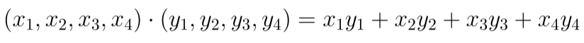
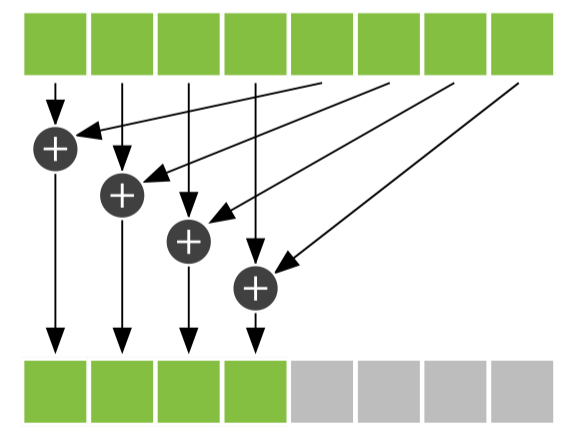
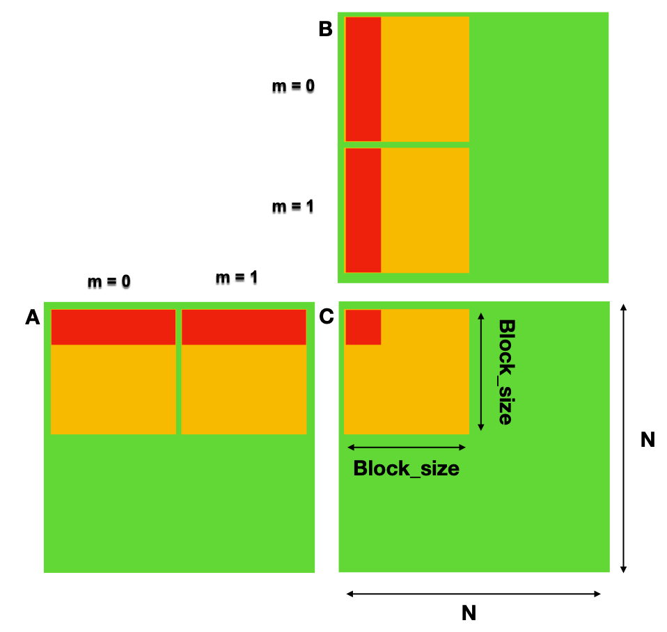

## TP5 : Programmation GPU en CUDA

### Informations sur le TP :
----------------------------
* Le TP est à réaliser seul ou en binôme.
* A rendre sur ametice en spécifiant si vous avez fait le TP seul ou en binôme, en mentionnant votre prénom ainsi que votre nom (prénom et nom de chaque membre si en binôme).
* A rendre avant le 31 mars 2023, 24:00.

### Exercice 1 : Reduction via produit scalaire.
------------------------------------------------

Le but de cette exercice est de faire une reduction en implémentant un produit scalaire utilisant la mémoire global et partagée.

Ce calcul se fait en deux étapes. Tout d'abord, nous multiplions les éléments correspondants des deux vecteurs d'entrée. Cette opération est très similaire à l'addition de vecteurs, mais elle utilise la multiplication au lieu de l'addition. Cependant, au lieu de stocker ces valeurs dans un troisième vecteur de sortie, nous les additionnons toutes pour produire une seule sortie scalaire.

Exemple de produit scalaire entre deux vecteurs :

Nous pouvons effectuer la première étape exactement comme comme une addition vectorielle. Chaque thread multiplie une paire d'entrées correspondantes, puis puis la stocke dans un cache (tableau en mémoire partagée).

La façon la plus naïve d'effectuer une réduction consisterait à demander à un thread de parcourir la mémoire partagée et de calculer une somme courante. Cette opération prendrait un temps proportionnel à la longueur du tableau. Cependant, comme nous disposons de centaines de threads pour effectuer notre travail, nous pouvons effectuer cette réduction en parallèle et prendre un temps proportionnel au logarithme de la longueur du tableau. 

L'idée générale est que chaque thread additionne deux des valeurs contenues dans le **cache** et stocke le résultat dans le **cache**. Puisque chaque thread combine deux entrées en une seule, nous terminons cette étape avec moitié moins d'entrées qu'au départ. Dans l'étape suivante, nous faisons la même chose avec la moitié restante. Nous continuons ainsi pour log2(threadsPerBlock) étapes jusqu'à ce que nous ayons la somme de chaque entrée dans **cache**. Pour l'exercice, nous utilisons 256 threads par bloc, il faut donc 8 itérations de ce processus pour réduire les 256 entrées de **cache** à une seule somme.

Pour la première étape de la reduction, nous commençons avec i comme moitié du nombre de threadsPerBlock. Nous voulons que seuls les threads dont l'indice est inférieur à cette valeur travaillent. Nous ajoutons donc conditionnellement deux entrées du **cache** si l'index du thread est inférieur à i. Nous protégeons notre ajout à l'intérieur d'une condition if. Chaque thread prendra l'entrée à son index dans le **cache**, l'ajoutera à l'entrée à son index décalé de i, et stockera cette somme dans **cache** (Faites attention à la synchronisation des threads.). On divise ensuite i par 2 pour les prochaines étapes.

Une fois la reduction terminé il suffit de récupérer le premier élément du **cache** qui est le résultat du produit_scalaire.

### Exercice 2 : Multiplication matricielle 3D
----------------------------------------------

Le but de cet exercice et d'implementer deux version d'une multiplication de matrices 3D. Une premiere versions dans la mémoire globale et une deuxieme version en utilisant la mémoire partagée.

Une matrice 3D n'est rien d'autre qu'une collection (ou une pile) de plusieurs matrices 2D, tout comme une matrice 2D est une collection/une pile de plusieurs vecteurs 1D. Ainsi, la multiplication de matrices 3D implique de multiples multiplications de matrices 2D, ce qui se résume finalement à un produit scalaire entre leurs vecteurs ligne/colonne.

Nous avons déja vu comment indexer les threads en 2D en utilisant un indexage par colonne (col) et un indexage par ligne (row). Dans cet exercice il faudra prendre en compte un 3eme indexage en profondeur(depth).

Si vous avez du mal a comprendre quelque chose, n'hésitez pas à venir me voir.

Pour la partie 2.6, voici la Figure : 

